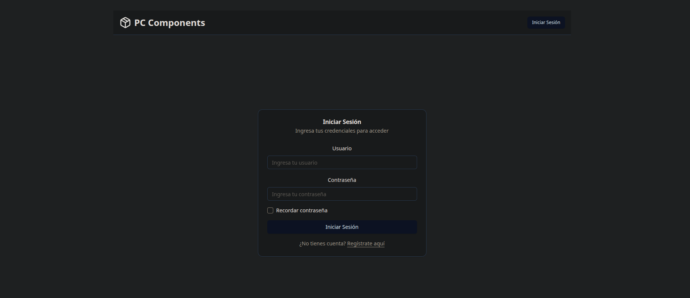
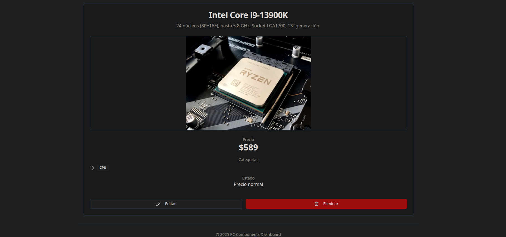
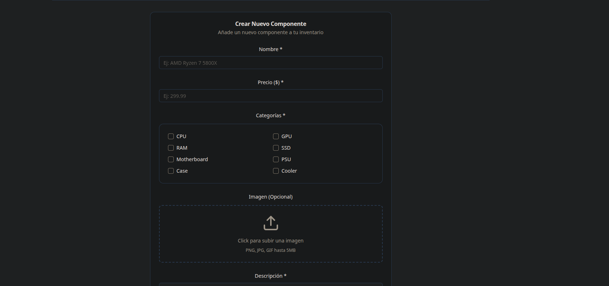
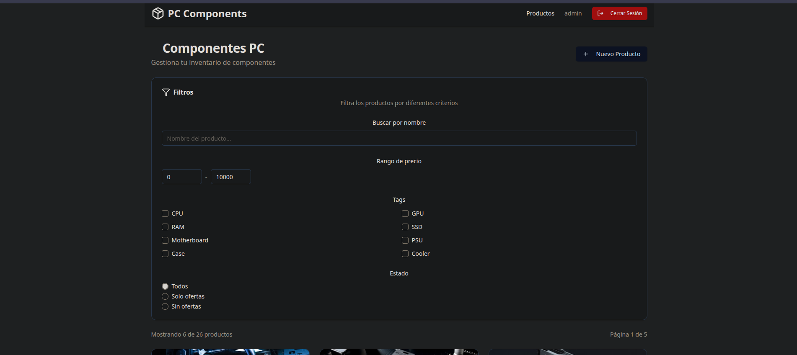

# 🖥️ Dashboard de Componentes PC

Aplicación web fullstack para gestionar un inventario de componentes de PC con autenticación JWT, desarrollada como práctica del bootcamp KeepCoding Web 19 (Diciembre 2024).

## 📸 Capturas de Pantalla

### Login

*Página de login con checkbox "Recordar contraseña" y validación*

### Listado de Productos

*Listado con filtros avanzados, paginación (6 por página) y grid responsive*

### Detalle de Producto

*Vista detallada con imagen, precio, categorías y acciones (editar/eliminar)*

### Crear Producto

*Formulario completo con upload de imágenes y validaciones en tiempo real*

### Filtros Activos

*Sistema de filtros client-side: nombre, precio, tags y estado (ofertas)*

## 🛠️ Tecnologías Utilizadas

### Frontend
- **React 19** - Biblioteca de UI
- **TypeScript** - Tipado estático
- **Vite** - Build tool y dev server
- **React Router v7** - Navegación (Data Mode)
- **shadcn/ui** - Componentes UI modernos
- **Tailwind CSS** - Estilos utility-first
- **Sonner** - Toast notifications
- **Lucide React** - Iconos

### Backend
- **Sparrest.js** - JSON Server con autenticación JWT
- **bcrypt** - Hash de contraseñas
- **Node.js** - Runtime

## ✨ Características Implementadas

### Autenticación
- ✅ Registro de usuarios con validación
- ✅ Login con JWT y persistencia de sesión
- ✅ Logout con limpieza de estado
- ✅ Context API para estado global de autenticación
- ✅ Rutas protegidas con redirect automático

### CRUD de Productos
- ✅ **Crear:** Formulario manual (sin librerías) con validación
- ✅ **Leer:** Listado con grid responsive y detalle individual
- ✅ **Actualizar:** Formulario precargado con datos existentes
- ✅ **Eliminar:** Con modal de confirmación (AlertDialog)

### Filtros (Client-side)
- ✅ Búsqueda por nombre (en tiempo real)
- ✅ Rango de precio (min/max)
- ✅ Filtro por tags/categorías (múltiple)
- ✅ Filtro por estado (ofertas/sin ofertas/todos)
- ✅ Contador de resultados filtrados

### UX/UI
- ✅ Diseño moderno con shadcn/ui
- ✅ Tema con buen contraste (fondo gris claro)
- ✅ Toast notifications para feedback
- ✅ Loading states en todas las operaciones
- ✅ Manejo completo de errores HTTP
- ✅ Iconos descriptivos (Lucide)

### Manejo de Errores
- ✅ Error de conexión (backend desconectado)
- ✅ Error 401 (no autenticado) → redirect a login
- ✅ Error 403 (sin permisos)
- ✅ Error 404 (recurso no encontrado)
- ✅ Error 500 (error del servidor)
- ✅ Mensajes claros y contextuales

## 📁 Estructura del Proyecto
```
├── server/                      # Backend (Sparrest.js)
│   ├── db.json                 # Base de datos JSON
│   ├── .env                    # Variables de entorno
│   └── index.js                # Servidor
│
├── src/
│   ├── core/                   # Componentes y lógica compartida
│   │   ├── components/         # Header, ProtectedRoute, ConfirmDialog
│   │   ├── routes/            # Configuración de rutas
│   │   ├── types/             # Tipos compartidos
│   │   └── utils/             # Helpers (http-errors)
│   │
│   ├── features/              # Funcionalidades por módulo
│   │   ├── auth/             # Autenticación
│   │   │   ├── components/   # LoginForm
│   │   │   ├── context/      # AuthContext (estado global)
│   │   │   ├── hooks/        # [movido a context]
│   │   │   ├── pages/        # LoginPage, RegisterPage
│   │   │   ├── services/     # auth.service (API)
│   │   │   └── types/        # User, LoginCredentials
│   │   │
│   │   └── products/         # Gestión de productos
│   │       ├── components/   # ProductCard, ProductForm, ProductFilters
│   │       ├── hooks/        # useProducts, useProduct
│   │       ├── pages/        # ProductsPage, ProductDetailPage, etc.
│   │       ├── services/     # products.service (API)
│   │       ├── types/        # PCComponent, ProductFilters
│   │       └── utils/        # filterProducts
│   │
│   ├── components/ui/         # shadcn/ui components
│   ├── App.tsx               # Layout principal
│   └── main.tsx              # Entry point con AuthProvider
│
├── .env                       # Variables de entorno frontend
└── README.md                  # Este archivo
```

## 🚀 Instalación y Ejecución

### Requisitos Previos
- Node.js 18+ 
- npm 9+

### 1. Clonar el repositorio
```bash
git clone <tu-repositorio>
cd Practica-React
```

### 2. Instalar dependencias

**Frontend:**
```bash
npm install
```

**Backend:**
```bash
cd server
npm install
cd ..
```

### 3. Configurar variables de entorno

**Frontend (.env en raíz):**
```bash
cp .env.example .env
```

Contenido de `.env`:
```env
VITE_API_URL=http://localhost:8000/api
VITE_BASE_URL=http://localhost:8000
```

**Backend (server/.env):**
```bash
cp server/.env.example server/.env
```

Contenido de `server/.env`:
```env
SECRET_KEY=Annie is Vader
PORT=8000
DB_FILE=db.json
JWT_EXPIRATION=24h
SALT=10
AUTH_READ=yes
AUTH_WRITE=yes
```

⚠️ **Importante:** `AUTH_READ=yes` requiere autenticación para LEER productos.

### 4. Ejecutar la aplicación

**Opción A: Todo junto (Recomendado)**
```bash
npm run dev:full
```

**Opción B: Por separado**

Terminal 1 - Backend:
```bash
npm run server
```

Terminal 2 - Frontend:
```bash
npm run dev
```

### 5. Acceder a la aplicación

- Frontend: http://localhost:5173
- Backend: http://localhost:8000

## 🔐 Credenciales de Prueba
```
Usuario: admin
Contraseña: 1234
```

También puedes registrar nuevos usuarios en `/register`

## 📜 Scripts Disponibles
```json
{
  "dev": "Solo frontend (Vite)",
  "server": "Solo backend (Sparrest)",
  "dev:full": "Frontend + Backend simultáneamente",
  "build": "Compilar para producción",
  "lint": "Linter de código"
}
```

## 🏗️ Arquitectura y Decisiones Técnicas

### Patrón de Arquitectura
- **Feature-based structure:** Código organizado por funcionalidad
- **Service layer:** Separación de lógica de API
- **Custom hooks:** Lógica de negocio reutilizable
- **Context API:** Estado global de autenticación

### Flujo de Datos
```
Components → Custom Hooks → Services → API
                ↓
            Context API (auth)
```

### Manejo de Estado
- **Local state:** `useState` para UI y formularios
- **Global state:** Context API solo para autenticación
- **Server state:** Custom hooks (`useProducts`, `useProduct`)

### Rutas Protegidas
```typescript
ProtectedRoute → verifica token → permite acceso o redirect a /login
```

### Formularios
- ✅ Patrón de controlled components
- ✅ Validación HTML5 + TypeScript
- ✅ Feedback con toasts

## ⚙️ Configuración de Backend

El backend usa **Sparrest.js**, un fork de json-server con JWT.

### Endpoints Disponibles

**Autenticación (sin /api):**
- `POST /auth/register` - Registrar usuario
- `POST /auth/login` - Obtener JWT token

**Productos (con /api, requieren JWT):**
- `GET /api/products` - Listar productos
- `GET /api/products/:id` - Ver detalle
- `POST /api/products` - Crear producto
- `PATCH /api/products/:id` - Actualizar producto
- `DELETE /api/products/:id` - Eliminar producto

**Otros:**
- `GET /api/tags` - Listar tags disponibles
- `POST /upload` - Subir imágenes (multipart)

### Autenticación
Todos los endpoints de `/api/*` requieren header:
```
Authorization: Bearer <JWT_TOKEN>
```

## 📝 Notas Importantes

- El backend usa un archivo JSON (`server/db.json`) como base de datos.
- Las contraseñas se almacenan hasheadas con bcrypt.
- El token JWT expira en 24 horas (configurable en `.env`).
### Tecnologías Adicionales 
- ✅ shadcn/ui - Componentes UI visuales
- ✅ Tailwind CSS - Estilos
- ✅ Sonner - Toasts
- ✅ Lucide React - Iconos

## 🐛 Troubleshooting

**Error: "No se pudo conectar con el servidor"**
- Verifica que el backend esté corriendo en puerto 8000
- Usa `npm run dev:full` para arrancar todo

**Error 401 al ver productos**
- Necesitas estar autenticado (AUTH_READ=yes)
- Haz login primero

**Los filtros no funcionan**
- Los filtros son client-side, funcionan con datos ya cargados
- Si no ves productos, verifica la autenticación

## 👨‍💻 Desarrollo

### Añadir un nuevo componente shadcn/ui
```bash
npx shadcn@latest add <component-name>
```

### Añadir un nuevo producto de prueba
Edita `server/db.json` y reinicia el backend.

## 📄 Licencia

Proyecto educativo - KeepCoding Web Bootcamp 19 (2024)

---

